## **Accelerating RWKV v7 RNN Large Model Training and RWKV V7 Architecture Multimodal Model Research with AMD Instinct™ MI300X and Radeon™ GPUs**

---

The landscape of Large Language Models (LLMs) is rapidly advancing, with innovative architectures like RWKV (Receptance Weighted Key Value) emerging to push the boundaries of performance and efficiency. RWKV-v7, a cutting-edge design, ingeniously merges the parallelizable training advantages of Transformers with the efficient, constant-memory inference of Recurrent Neural Networks (RNNs). This unique blend makes it particularly well-suited for both traditional large language modeling and the burgeoning field of multimodal AI. This blog post serves as a comprehensive guide for data scientists and machine learning engineers, detailing how to leverage the immense power of AMD Instinct™ MI300X accelerators for large-scale pre-training and supervised fine-tuning (SFT) of RWKV-v7 models. Furthermore, we will explore the exciting potential of the RWKV-v7 architecture in multimodal research, demonstrating how its efficient design can accelerate the development of multimodal models. Additionally, we will showcase the feasibility of pre-training smaller RWKV models on accessible, consumer-grade AMD Radeon™ GPUs, thus democratizing access to LLM experimentation and research for a broader community. By providing practical insights and methodologies, we aim to empower researchers and developers to fully harness the capabilities of RWKV-v7 on AMD hardware for both foundational large model training and groundbreaking multimodal applications.

### **1. Introduction to the RWKV-v7 Architecture**

*   **What is RWKV?** Briefly explain the RWKV architecture, highlighting its key features: a linear-complexity RNN that can be trained in parallel like a Transformer.
*   **Advantages over Traditional Transformers:** Discuss the benefits, such as constant memory and computational complexity during inference, making it ideal for long sequences.
*   **[RWKV LM official GitHub Repo](https://github.com/BlinkDL/RWKV-LM)**

### **2. Part 1: Training RWKV V7 architecture model on AMD Instinct™ MI300X Accelerators**
* **[RWKV V7 For AMD Hip Kernel Support GitHub Repo](https://github.com/RWKV-Vibe/RWKV-LM-V7)**
#### **2.1. Environment Setup**

*   **Hardware and Software Prerequisites:**
    *   Recommended Hardware: AMD Instinct™ MI300 Series, MI200 Series.
    *   Software: Ubuntu 24.04 LTS, AMD ROCm™ 6.4 or newer.
    *   Key Libraries: PyTorch with ROCm support, Transformers,  pytorch-lightning==1.9.5, deepspeed, wandb, ninja, rwkv-fla[rocm]
```bash
yes | apt install python3.12-venv htop nvtop radeontop screen python3.12-venv python-is-python3;
python -m venv ~/venv --system-site-packages;
source ~/venv/bin/activate;
pip install torch torchvision --index-url https://download.pytorch.org/whl/rocm6.4;
pip install rwkv-fla[rocm] deepspeed ninja transformers einops rwkv pytorch-lightning==1.9.5 datasets jsonlines wandb; 
```

#### **2.2. Pre-training RWKV-v7 minipile test**
* We have Hip kernel transfered from cuda kernel to accelerate the RWKV V7 model pretraning 

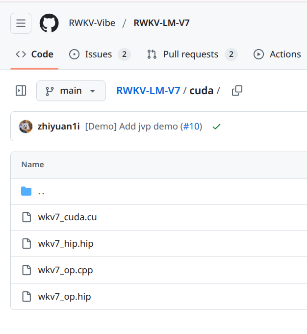
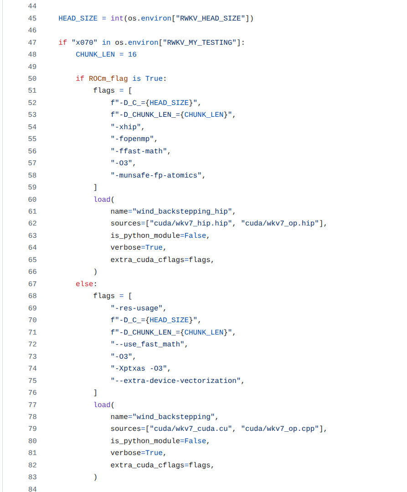

*   **Dataset Preparation:**
```bash
git clone https://github.com/RWKV-Vibe/RWKV-LM-V7.git;
cd ./RWKV-LM-V7
wget data/minipile.idx https://huggingface.co/datasets/BlinkDL/minipile-tokenized/resolve/main/rwkv_vocab_v20230424/minipile.idx;
wget data/minipile.bin https://huggingface.co/datasets/BlinkDL/minipile-tokenized/resolve/main/rwkv_vocab_v20230424/minipile.bin;
```
*   **Start Pre-training 🚀**
1. Initialize an empty RWKV-7 model
```
sh ./demo-training-prepare.sh
```

2. Log in to your WandB account

3. Start training
```
sh ./demo-training-run.sh
```

#### **2.3. Fine-tuning base on a Pre-trained Model adapt to various application scenarios (RWKV Offline Translate model)**
   **The RWKV Translate model Huggingface Repo [🤗 RWKV_v7_G1_Translate](https://huggingface.co/Alic-Li/RWKV_v7_G1_Translate_ctx4096_20250620)**
   
   **The RWKV Translate model HuggingFace Space (Only two CPU) [🤗 RWKV_v7_G1_Translate_Space](https://huggingface.co/spaces/Alic-Li/RWKV_v7_G1_0.4B_Translate_ctx4096)**
*   **Instruction Dataset Preparation:**
    *   Datasets format {"text": "Chinese: text......\n\nEnglish: text......"}
    *   [🤗 Processed datasets Huggingface URL](https://huggingface.co/datasets/Alic-Li/Translate_datasets)
    *   The base pre-trained model weights  [RWKV_V7_G1](https://huggingface.co/BlinkDL/rwkv7-g1/tree/main)
*   **Configuring the SFT Run:**
    *   --lr_final 1e-6 --lr_init 2e-5 --ctxlen 2048
    *   --magic_prime 5554103 --micro_bsz 32 --my_exit_tokens 11374865357
    *   --load_model rwkv7-g1-0.4b-20250324-ctx4096.pth

*   **Loging your wandb Execution and Evaluation:**
```
sh ./demo-training-run.sh
```
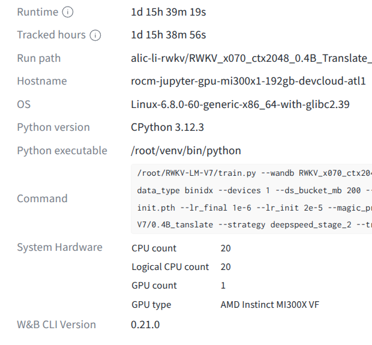
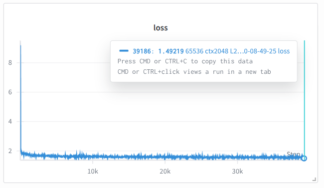

### **3. Part 2: Experimental the RWKV V7 Architecture Extreme miniaturization LLM on single AMD Radeon™ GPUs**

#### **3.1. Environment Setup for Radeon™**

*   **Hardware and Software Prerequisites:**
    *   Recommended Hardware: AMD Radeon™ RX 6000/7000/9000 Series or AMD Radeon™ Pro W7000 Series
    *   Software: Ubuntu 24.04 LTS, AMD ROCm™ 6.4 Softeware stack

#### **3.2. Pre-training a Extreme miniaturization LLM**
   **The MiniRWKV v7 model HuggingFace Space (Only two CPU) [🤗 Mini_RWKV_7_34.2M Space](https://huggingface.co/spaces/Alic-Li/Mini_RWKV_7_34.2M)**
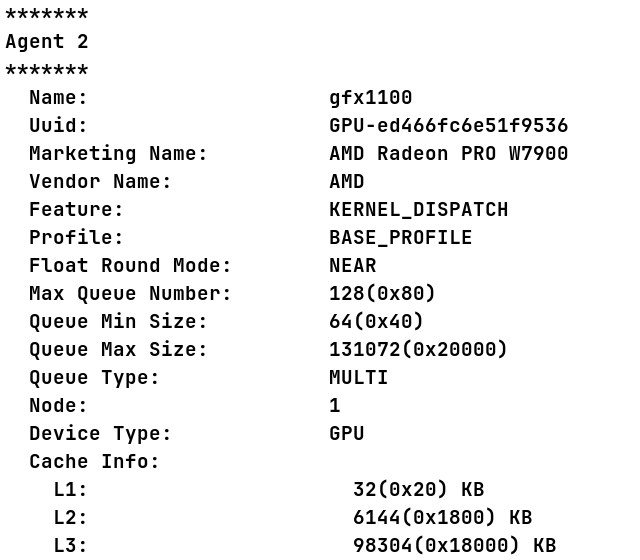

This section will guide researchers and Experimental the RWKV V7 Architecture  Multimodal Model on single AMD Radeon™ GPUs on a desktop PC equipped with singe consumer AMD Radeon™ GPU. [The Mini RWKV 34.2M GitHub Repo](https://github.com/Alic-Li/Mini_RWKV_7)

##### Mini RWKV 34.2M Pre-training & SFT training

**ctx 512 pre-train Loss**

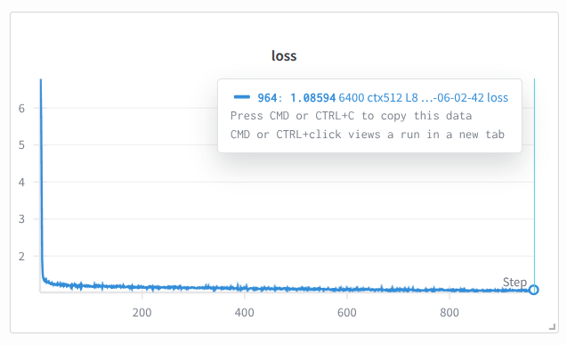

**ctx 2048 SFT Loss**

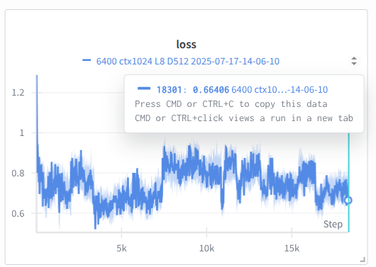 

### **4. Part 2: Experimental the RWKV V7 Architecture Multimodal Model on single AMD Radeon™ GPUs**

#### **4.1. Pre-training a low light enhancement RWKV V7 Architecture Multimodal Model**
##### Get the RetinexRWKV source code with Hip WKV Kernel in [The RetinexRWKV GitHub Repo](https://github.com/Alic-Li/RetinexRWKV)
##### The Gradient Descent

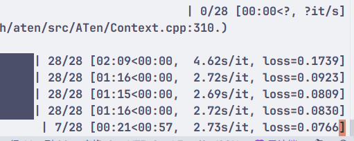

##### The Model Compute Flops & Parameters (Left RetinexRWKV Right RetinexFormer)

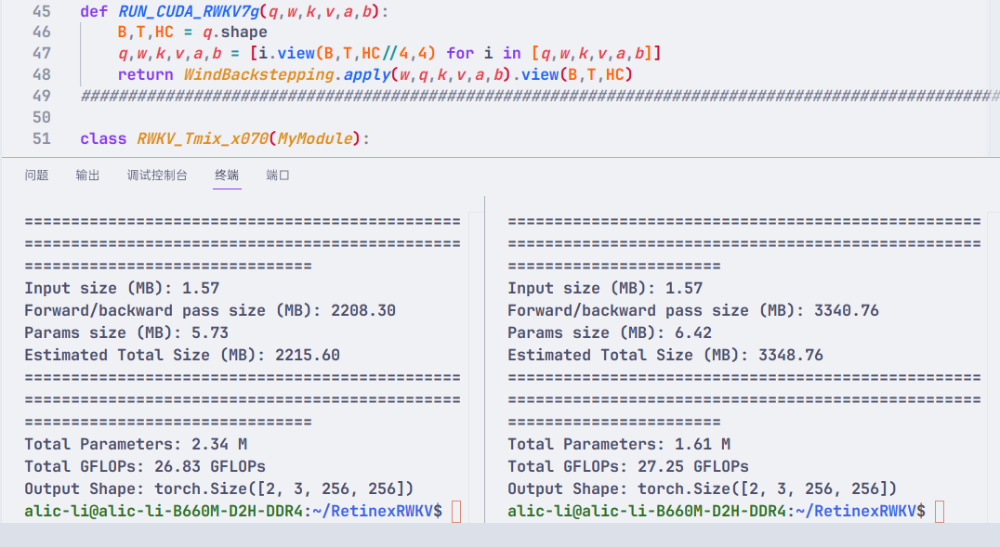

##### The RWKV WKV kernel compile

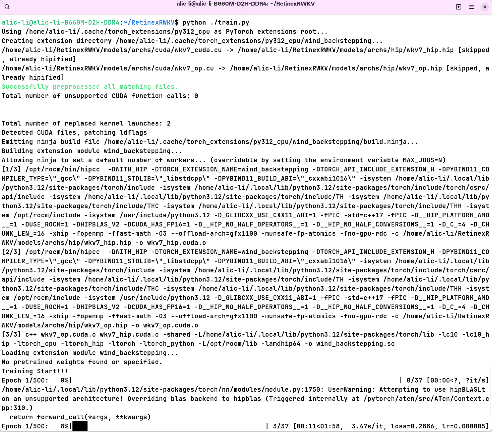

##### The GPU usage Training in model training

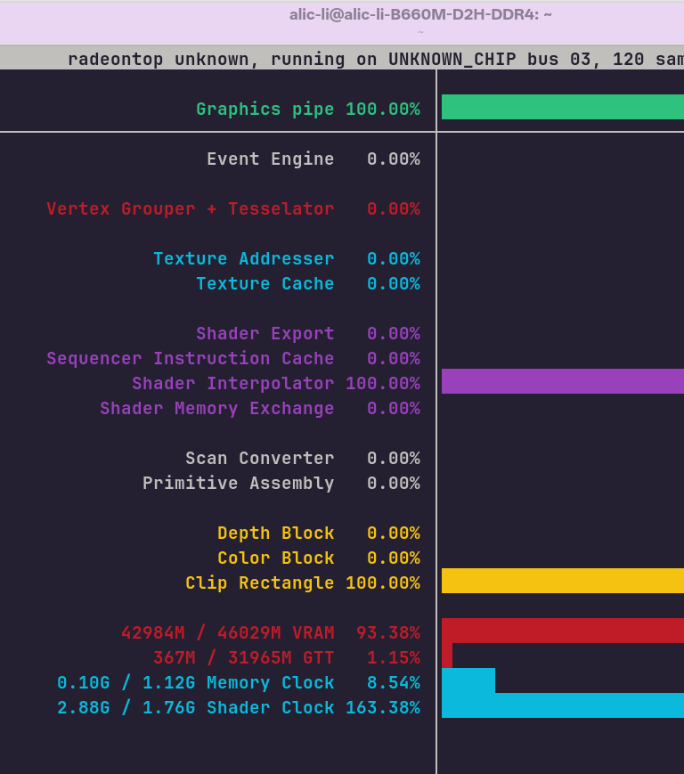

##### RetinexRWKV model inference results

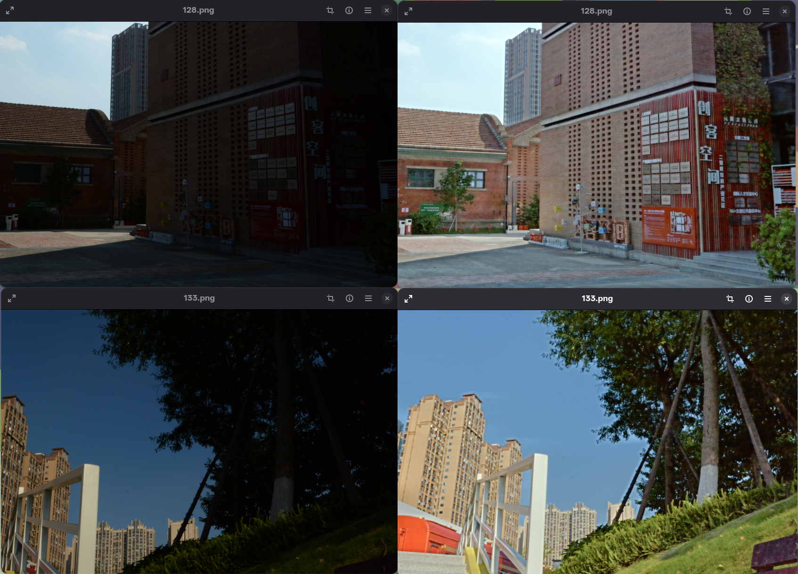

### **4. Conclusion**

*   **Summary of Achievements:**  In this blog post, we have successfully demonstrated the power and versatility of AMD Instinct™ MI300X accelerators for large-scale pre-training and supervised fine-tuning (SFT) of the cutting-edge RWKV-v7 models. We've also showcased how the efficient RWKV-v7 architecture, combined with AMD Radeon™ GPUs, makes experimental pre-training of smaller models accessible, opening new avenues for researchers and enthusiasts. 
*   **The Power of the AMD + Open Source Ecosystem:** The seamless integration of AMD's high-performance hardware, specifically the Instinct™ MI300X and Radeon™ GPUs, with the open-source ROCm™ software platform, is instrumental in fostering innovation in the LLM landscape. This powerful combination empowers the machine learning community to effectively train, fine-tune, and experiment with state-of-the-art open-source models like RWKV-v7. As an incubation project under the Linux Foundation AI & Data Foundation, RWKV benefits immensely from this open ecosystem, enabling rapid development and deployment.
*   **Call to Action:** We encourage all data scientists, machine learning engineers, and AI enthusiasts to explore the provided scripts and methodologies. Dive into the world of RWKV-v7 on AMD GPUs, contribute to the vibrant RWKV open-source projects, and unlock new possibilities in large model training and multimodal AI research. Your contributions are vital in pushing the boundaries of what's achievable with efficient and powerful AI architectures on AMD hardware.

### **5. Resources and Appendix**

**Official website with Documentation:** 
*	International official website[www.rwkv.com](www.rwkv.com)
*   Chinese official website:[www.rwkv.cn](www.rwkv.cn)


**Acknowledgements:** We extend our sincere gratitude to Bo Peng (BlinkDL), the visionary creator and lead of the RWKV project, for his groundbreaking work in reinventing RNNs. We also thank the entire RWKV open-source community for their continuous contributions, research, and dedication to advancing this innovative architecture.